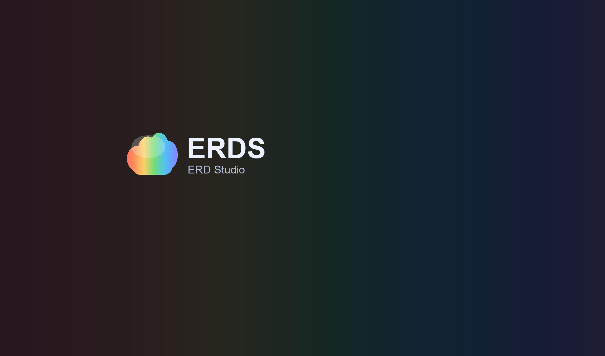

<h1 align="center">
  <a href="https://github.com/akshwpsh/erd-studio#gh-light-mode-only">
    
  </a>
  <a href="https://github.com/akshwpsh/erd-studio#gh-dark-mode-only">
    
  </a>
  <br>
</h1>

<p align="center">
  <b>Open-source database diagrams editor</b> <br />
  <b>No installations • No Database password required.</b> <br />
</p>

<h3 align="center">
  <a href="https://github.com/akshwpsh/erd-studio">Repository</a>  &bull;
  <a href="https://github.com/akshwpsh/erd-studio/issues">Issues</a>  &bull;
  <a href="https://chartdb.io/templates?ref=github_readme">Upstream Examples</a>  &bull;
  <a href="https://app.chartdb.io?ref=github_readme">Upstream Demo</a>
</h3>

<h4 align="center">
  <a href="https://github.com/akshwpsh/erd-studio?tab=AGPL-3.0-1-ov-file#readme">
    
  </a>
  <a href="https://github.com/akshwpsh/erd-studio/blob/main/CONTRIBUTING.md">
    
  </a>
  <a href="https://discord.gg/QeFwyWSKwC">
    
  </a>
  <a href="https://x.com/intent/follow?screen_name=jonathanfishner">
    
  </a>

</h4>

---

<p align="center">
  
</p>

### 🎉 ERDS

ERDS is a powerful, web-based database diagramming editor.
Instantly visualize your database schema with a single **"Smart Query."** Customize diagrams, export SQL scripts, and access all features—no account required. Experience seamless database design here.

> ERD Studio is a modified fork of [ChartDB](https://github.com/chartdb/chartdb), licensed under AGPL-3.0.

**What it does**:

- **Instant Schema Import**
  Run a single query to instantly retrieve your database schema as JSON. This makes it incredibly fast to visualize your database schema, whether for documentation, team discussions, or simply understanding your data better.

- **AI-Powered Export for Easy Migration**
  Our AI-driven export feature allows you to generate the DDL script in the dialect of your choice. Whether you're migrating from MySQL to PostgreSQL or from SQLite to MariaDB, ERDS simplifies the process by providing the necessary scripts tailored to your target database.
- **Interactive Editing**
  Fine-tune your database schema using our intuitive editor. Easily make adjustments or annotations to better visualize complex structures.

### Status

ERDS is currently in Public Beta. Star and watch this repository to get notified of updates.

### Supported Databases

- ✅ PostgreSQL ( +  +  )
- ✅ MySQL
- ✅ SQL Server
- ✅ MariaDB
- ✅ SQLite ( +  Cloudflare D1)
- ✅ CockroachDB
- ✅ ClickHouse

## Getting Started

Use local deployment, or try the [upstream cloud version](https://app.chartdb.io?ref=github_readme_2):

### How To Use

```bash
npm install
npm run dev
```

### Build

```bash
npm install
npm run build
```

### Deploy to Vercel (Hobby)

This project can be hosted as a static Vite app on Vercel Hobby.

1. Import this repository in Vercel.
2. Set these build settings:
   - Framework Preset: `Vite`
   - Build Command: `npm run build`
   - Output Directory: `dist`
3. Add environment variables in Vercel Project Settings (Build & Runtime):
   - `VITE_SUPABASE_URL`
   - `VITE_SUPABASE_PUBLISHABLE_DEFAULT_KEY`
   - Optional: `VITE_OPENAI_API_ENDPOINT`, `VITE_LLM_MODEL_NAME`, `VITE_HIDE_CHARTDB_CLOUD`, `VITE_DISABLE_ANALYTICS`
4. Deploy.

SPA routing is configured via `vercel.json`, so deep links like `/templates/...` and `/invites/...` resolve to `index.html`.

> **Security note:** Do not place a private LLM key in `VITE_OPENAI_API_KEY` for production. `VITE_*` values are exposed to the browser.

### Supabase Cloud Storage Setup

ERDS now supports cloud persistence via Supabase (Auth + Postgres + Realtime).

1. Create a Supabase project.
2. In Supabase SQL Editor, run the schema and RLS script from:

```bash
supabase/schema.sql
```

3. In Supabase SQL Editor, run profile image storage setup:

```bash
supabase/profile-storage.sql
```

4. In Supabase SQL Editor, run collaboration setup (memberships, invitations, RPC, RLS):

```bash
supabase/collaboration.sql
```

5. In Supabase Auth settings, enable Email provider and configure your site URL and redirect URLs (used when email confirmation is enabled). Include your local URL (for example `http://localhost:8080`) and your deployed URL (for example `https://<your-project>.vercel.app`).
6. Set frontend environment variables:

```bash
VITE_SUPABASE_URL=<YOUR_SUPABASE_URL>
VITE_SUPABASE_PUBLISHABLE_DEFAULT_KEY=<YOUR_SUPABASE_PUBLISHABLE_DEFAULT_KEY>
```

Profile image upload requires the `profile-images` storage bucket and policies from `supabase/profile-storage.sql`. If storage upload fails, nickname/password updates still continue.

Collaboration notes:
- Share links use `/invites/:inviteToken`.
- Invitation acceptance requires the signed-in account email to match the invited email (case-insensitive).
- Roles: `owner` (implicit), `editor`, `viewer`.
- `viewer` can open and receive realtime updates/presence, but cannot modify diagram data.

### Troubleshooting invite 404 (Vercel + Supabase)

If invite creation fails with a 404 on `/rest/v1/rpc/create_diagram_invitation`:

1. In Supabase SQL Editor, run:

```bash
supabase/check-collaboration-rpc.sql
```

2. If the function/signature is missing, re-run:

```bash
supabase/collaboration.sql
```

3. Confirm Vercel env vars point to the same Supabase project:
   - `VITE_SUPABASE_URL`
   - `VITE_SUPABASE_PUBLISHABLE_DEFAULT_KEY`

Or like this if you want to have AI capabilities:

```bash
npm install
VITE_OPENAI_API_KEY=<YOUR_OPEN_AI_KEY> npm run build
```

### Run the Docker Container

```bash
docker run \
  -e OPENAI_API_KEY=<YOUR_OPEN_AI_KEY> \
  -e SUPABASE_URL=<YOUR_SUPABASE_URL> \
  -e SUPABASE_PUBLISHABLE_DEFAULT_KEY=<YOUR_SUPABASE_PUBLISHABLE_DEFAULT_KEY> \
  -p 8080:80 ghcr.io/akshwpsh/erd-studio:latest
```

#### Build and Run locally

```bash
docker build -t erd-studio .
docker run \
  -e OPENAI_API_KEY=<YOUR_OPEN_AI_KEY> \
  -e SUPABASE_URL=<YOUR_SUPABASE_URL> \
  -e SUPABASE_PUBLISHABLE_DEFAULT_KEY=<YOUR_SUPABASE_PUBLISHABLE_DEFAULT_KEY> \
  -p 8080:80 erd-studio
```

#### Using Custom Inference Server

```bash
# Build
docker build \
  --build-arg VITE_OPENAI_API_ENDPOINT=<YOUR_ENDPOINT> \
  --build-arg VITE_LLM_MODEL_NAME=<YOUR_MODEL_NAME> \
  -t erd-studio .

# Run
docker run \
  -e OPENAI_API_ENDPOINT=<YOUR_ENDPOINT> \
  -e LLM_MODEL_NAME=<YOUR_MODEL_NAME> \
  -e SUPABASE_URL=<YOUR_SUPABASE_URL> \
  -e SUPABASE_PUBLISHABLE_DEFAULT_KEY=<YOUR_SUPABASE_PUBLISHABLE_DEFAULT_KEY> \
  -p 8080:80 erd-studio
```

> **Privacy Note:** ERDS includes privacy-focused analytics via Fathom Analytics. You can disable this by adding `-e DISABLE_ANALYTICS=true` to the run command or `--build-arg VITE_DISABLE_ANALYTICS=true` when building.

> **Note:** You must configure either Option 1 (OpenAI API key) OR Option 2 (Custom endpoint and model name) for AI capabilities to work. Do not mix the two options.

Open your browser and navigate to `http://localhost:8080`.

Example configuration for a local vLLM server:

```bash
VITE_OPENAI_API_ENDPOINT=http://localhost:8000/v1
VITE_LLM_MODEL_NAME=Qwen/Qwen2.5-32B-Instruct-AWQ
```

## Try the upstream cloud version

1. Go to [ChartDB.io](https://chartdb.io?ref=github_readme_2)
2. Click "Go to app"
3. Choose the database that you are using.
4. Take the magic query and run it in your database.
5. Copy and paste the resulting JSON set into ERDS.
6. Enjoy Viewing & Editing!

## 💚 Community & Support

- [GitHub Issues](https://github.com/akshwpsh/erd-studio/issues) (Report bugs in this fork)
- [Repository](https://github.com/akshwpsh/erd-studio) (Source code for ERD Studio)
- [Upstream ChartDB](https://github.com/chartdb/chartdb) (Original project and upstream updates)

## Contributing

We welcome community contributions, big or small, and are here to guide you along
the way. Message us in the [ERDS Community Discord](https://discord.gg/QeFwyWSKwC).

For more information on how to contribute, please see our
[Contributing Guide](/CONTRIBUTING.md).

This project is released with a [Contributor Code of Conduct](/CODE_OF_CONDUCT.md).
By participating in this project, you agree to follow its terms.

Thank you for helping us make ERDS better for everyone :heart:.

## License

ERDS is licensed under the [GNU Affero General Public License v3.0](LICENSE)
